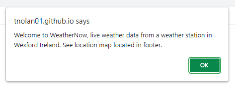

# WeatherNow
### Deployed Site : https://tnolan01.github.io/weather/
<br>

<br>

### Introduction:
*WeatherNow is a website designed using HTML, CSS and JavaScript. The primary function of which is to extract real-time and historical weather data from a particular private weather station. The private weather station, PWS, uploads data to a website called Weather Underground, https://www.wunderground.com/.  WeatherNow extracts that data from wunderground.com via an API and displays the information in a more user friendly and exact format.*

<br>

# Project Outline
<br>

<div id="contents" style="font-weight: bold;">Contents:</div>

1. [Project Scope](#project_scope)

2. [Design & Stylings](#design)

3. [Structure](#structure)

4. [Testing](#testing)

5. [Deployment & Cloning](#deployment)

6. [Technologies Used](#tech)

7. [Project Credits](#credits)

<br>

## Project Scope: <div id="project_scope"></div> 

### User Stories:

<p>Farmer Browne has just purchased a new farm, a 250-hectare block of land in the 'Sunny' Southeast corner of Ireland, county Wexford. This parcel of ground is approximately 40 kilometers from Farmer Brownes main center of operations, but the quality of the land makes it excellent for food production.
Farmer Browne is a tillage farmer and his main crops are Potatoes and Cabbage in rotation with Barley. Key factors for Farmer Browne to consider from the sowing to harvesting cycles of these crops would be as follows:</p>
<ul>
<li> Recent precipitation totals.</li>
<li> Recent temperature range. </li>
<li> Humidity levels.</li>
<li> Wind strength and direction. </li>
</ul>

<br>

*Examples:*
<ul>
<li> Deciding where and when to send his employees to harvest vegetables, many of which are still hand cut and very labour intensive.</li>
<li> Deciding on when and if he can spray crops.</li>
<li> Deciding on most suitable harvesting times.</li>
<li> Deciding if recent levels of precipitation have left the ground to soft to travel on or are insufficient for crop growth. </li>
</ul>

<p> The website will also be accessible to anyone in the area, other farmers, local residents etc. 

<br>
<p> Luckily for Farmer Browne a property adjoining his new land has a PWS which is active and uploading weather data to the Weather Underground website.</p>

### Scope:
*Design a website to allow Farmer Browne simple and up to date access to weather conditions on this new remote site without the need to drive the 80-kilometer round trip from his yard. Provide Farmer Browne with the information to make better decisions about how he deploys his staff and where and when he sends his machinery, equipment which is slow and expensive and would consume a lot of diesel on the 80-kilometer trip.*

<ol>
<li> Ascertain the information the end user, Farmer Browne, requires. </li>
<li> Using the API key provided by the owner of the local PWS, retrieve the required data from wunderground.com </li>
<li> Design and deploy a site to show the data in a simple accessible manner. </li>
</ol>

The site must be...
<ol>
<li> Simple to use with a clear uncluttered display which is easy to read. </li>
<li> Responsive to use on smaller screens. </li>
<li> Have a forecast / weather projection function. </li>
</ol>


[Back to Contents](#contents)


## Design: <div id="design"></div> 

#### Primary Coloring:
<br>
<ul>
<li> The primary back-ground color is white to enhance brightness when used on small screen and/or outdoors and in dark conditions.</li>
<li> Grey header and footer with text in white for clarity and contrast. Grey color acting as a frame for the begining and end of the data section.  </li>
<li> Use of orange as high-light color. Orange is used to distinguish sections and values. I also used the orange color with the 'hover' property to show when the user is over a selectable option on the header and footer sections.
<li> I used blue with the 'hover' property on the buttons on the Charts page to help distinguish which button the user is hovering over. </li>
<li> The site has a simple weather-related logo in the top left-hand corner of the screen.</li>
</ul> 


<br>
<br>

#### Font:
<br>
<p> I am using a font called <span style="color: lightblue;">'Titillium Web'</span> from Google Fonts.

<p>Styling of the html structure is handled by the file located in the css folder. </p>
<br>
<br>
[Back to Contents](#contents)

## Structure:
### Site Structure:
<p> The site is built with a HTML structure, with styling through CSS and with the functionality coded with JavaScript. <p>
<p> I am using Application Programming Interface, API, to communicate with <wunderground.com> and retrieve JSON data relating to a particular weather station. </p>
<p> Data displayed on the site is retrieved by JavaScript fetch requests</p> 

<h4 id="headerRef" style="color: orange; font-weight: bold">Header</h4>
<p>The header is common across all html pages. The hmtl structure is a div which contains 4no. anchor elements containing links to the relevant html pages.</p>
<p>The div has a class of <span style="color: orange;">'navbar'</span> and this class identifies the div for the appropriate stylings in style.css file. </p>


<br>

<h4 id="footerRef" style="color: orange; font-weight: bold">Footer</h4>
<p>The header is also common across all html pages. The hmtl structure of the footer is a div. This div contains 1no. anchor element which has a link to the relevant 'pws_map.html' page. There is also a H5 heading which contains the following the text 'Copyright Tim Nolan Jan2022. This site was designed for educational purposes.'</p>
<p>This div has a class of <span style="color: orange;">' footer'</span> and this class identifies the div for the appropriate stylings in style.css file. </p>


<br>

<h4 style="color: orange; font-weight: bold">index.html</h4>

<p>The index.html shows the current weather. The page is identified on the header as <span style="font-weight: bolder;">'Current'</span>. The page is constructed of box div's located inside a container, with a class of <span style="color: orange;">'container'</span>. Each box has a class of <span style="color: orange;">'box'</span> and contains a single weather-related value based on the most current data. I am using a grid structure to make these div's responsive. The box div's present as separate tiles. </p>
<p>The index.html is set to auto refresh every 240 seconds.</p> 

``` <meta http-equiv="refresh" content="240"> ```

The data displayed on tiles is retrieved via the [getWeather.js](#getWeather) JavaScript which is called when the page loads. 
<p>On load this page displays a pop up box to identify the position of the weather station and geographic area for which the data has relevance. There is code to make sure this message is only displayed the first time the user visits the site via localstorage.</p>


<br>
<br>
<p>Image of the pop up box.</p>

<br>

The index.html page also contains a span element below the page logo, this displays the date and time for which the data displayed was last updated. This date and time are retrieved along with the weather data via the [getWeather.js](#getWeather) JavaScript.


<br>


<h4 style="color: orange; font-weight: bold">pws_map.html</h4>

<p> The pws_map.html page contains the common header and footer elements along with a div with the id of <span style="color: orange;">'map'</span>. This id links to a Google Map's API function which renders a Google Map showing the position of weather station. The longitude and latitude used were retrieved from JSON data. </p>
<p>The script for the mapping is located in the head of the page. </p>
<p> There is also a span containing the longitude and latitude information. I have a text marker on the Google Map showing the words <span style="color: lightblue;">'Weather Station'</span>.


<br>

<h4 style="color: orange; font-weight: bold">forecast.html</h4>

<p> The forecast.html shows a projected 48hour forecast. The page is identified on the header as <span style="font-weight: bolder;">'Outlook'</span>. The page is constructed of box div's located inside a container. The container has a class of <span style="color: orange;">'container'</span>. Each box has a class of <span style="color: orange;">'fcbox'</span>. Each box again represents as a tile and contains a projected forecast for the local area. There are 4no. tiles each with the forecast of 12 hours.</p>


<br>

<ol>
<li>Tonight - projected forecast for the next 12 hours +.</li>
<li>Tomorrow - projected forecast for the period 13 to 24hours +.</li>
<li>Tomorrow Night - projected forecast for the period 25 to 36hours +.</li>
<li>Next Day - projected forecast for the period 37 to 48 hours +.</li>
</ol>

The forecast is generated from a fetch request to the relevant JSON data using the [forecast.js](#getForecast) script.
The values are based on most current data.

<h4 style="color: orange; font-weight: bold">history.html</h4>

<p> The history.html shows a summary of weather data for the previous 7 days. The page is identified on the header as <span style="font-weight: bolder;">'7 Day Review'</span>. The page is constructed of box div's located inside a container. The container has a class of <span style="color: orange;">'container'</span>. Each box has a class of <span style="color: orange;">'hisbox'</span>. </p>

<p>**Information displayed on each tile:**</p>
<ol>
<li>Date:</li>
<li>Average Temperature:</li>
<li>Rain Fall Total:</li>
<li>Average Wind Speed:</li>
<li>Average Humidity:</li> 
</ol>

<p> The tiles are arranged from most recent day, yesterday, backwards 6 further days. The page also contains a 'tile' which shows three calculations made from data retrieved.</p>
<ol>
<li> Rain fall total over the past 7days.</li>
<li> Average temperature over the past 7days.</li>
<li> Average humidity over the past 7days.</li>
</ol>

The data is generated from a fetch request to the relevant JSON data using the [getHistory.js](#getHistory) script. Using some of the values received some simple calculations are made to return values for the 7 day averages listed above.


<br>

<h4 style="color: orange; font-weight: bold">rain_chart.html</h4>

<p>This page contains 5no. buttons. The page is referenced on the header. as <span style="font-weight: bolder;">'Charts'</span>. The page contains a div with the class of <span style="color: orange;">'button_container'</span>. The five buttons are located inside this div, the buttons have a class named <span style="color: orange;">'button'</span>. The buttons have an orange border which changes to blue upon hovering over the relevant button.</p>
<p>The page has a div which holds a canvas element where the selected chart is created. The canvas had an id of <span style="color: orange;">'myChart'</span>.

<p>The buttons listed on this page are as follows.</p>
<ol>
<li>Precipitation Total, total precipitation for each of the previous 7 days displayed as a line chart.</li>
<li>Temperature Averages, the average temperature for each of the previous 7 days displayed as a line chart.</li>
<li>Sunshine Averages, the average levels of sunshine on each day over the previous 7 days.</li>
<li>Wind Data Chart, this chart displays the highest gust, lowest gust and average wind speed recorded on the particular day.</li>
<li>Download Chart, this button allows the user download the currently displayed chart as a png file.</li>
</ol>

I have written a separate JavaScript for the first four buttons as follows;
<br>

[rainChart.js](#rainChart)
<br>

[tempChart.js](#tempChart)
<br>

[solarChart.js](#solarChart)
<br>

[windChart.js](#windChart)

Each script fetch's the relevant JSON data and using Chart.js creates a line chart to display the data. The code for the download button is located in each of these JavaScripts.


<br>

<br>
<p>Download prompt box.</p>

<br>
<p>Example of downloaded chart.</p>

<br>
<p>Screen shot from IPhone 12.</p>

<br>
<br>

#### **JavaScript**

<h4 id="getWeather" style="color: orange; font-weight: bold">getWeather.js</h4>
With this script I am fetching JSON data relating to current weather conditions. I am creating variables for the particular data I require and returning these elements to the html with **document.getElementById**.
<p>I also convert the degree value of the wind direction into a cardinal position, primarily as the cardinal position will have more relevance to most people. Cardinal positions also read more clearly. This is a simple code which I got from Stack Overflow.</p>
<p>There is a line of code here for the pop up/alert box to tell the user where the geographic location of the weather station and so the area for which the data is most relevant.</p>

<h4 id="getHistory" style="color: orange; font-weight: bold">getHistory.js</h4>
<p>This script fetchs the JSON data arrays for each of the proceeding 7 days. I am picking certain data points and passing them in the html. I have three variables created for some simple calculations to display 7 days averages for humidity, temperature and precipitation.</p>
<p>I have added a Split and Trim alteration to the time part of the data as supplied from the JSON array and just show the date only, this displays is far clearer and cleaner.</p>

<h4 id="getForecast" style="color: orange; font-weight: bold">forecast.js</h4>
<p>The forecasting script simply fetchs JSON data via an API which accesses the data from the wunderground.com forecasting model. The data is broken into array items marked as *daypart*. I am using four of these to give a 48 hour projected forecast.</p> 

<h4 id="rainChart" style="color: orange; font-weight: bold">rainChart.js</h4>
<h4 id="tempChart" style="color: orange; font-weight: bold">tempChart.js</h4>
<h4 id="solarChart" style="color: orange; font-weight: bold">solarChart.js</h4>
<h4 id="windChart" style="color: orange; font-weight: bold">windChart.js</h4>
<p> These four scripts form the basis of rain_chart.html. All are similar in structure. Fetching the required data and then rendering into a line graph with Chart.js.</p>
<p> Other elements which form part of the functions that make up these scripts are as follows.</p>
<ul>
<li>Code to convert the date from the JSON format YYYY-MM-DD 00:00:00 to the relvant day name, ie. Monday, Tuesday etc. This is for the reason of clarity as the JSON date format would be to cluttered and unclear when shown on the graph.</li>
<li>I have also included code to destroy the 'canvas' prior to creating the new graph. Without this the you could not use the same canvas repeatedly to create the different graphs relating to the option selected. </li>
<li>I have created the variable to convert the newly create chart to a PNG image, the user has the option to download the currently displayed chart. A pop up prompts the user to confirm or cancel the download, if they have clicked the download button the png file is downloaded.</li> 
</ul>
<br>

[Back to Contents](#contents)
<br>

## Testing: <div id="testing"></div> 

### Validation Testing:
<p> I have successfully passed the code through the following validators. </p>

W3 HTHL Validator : [HMTL Results](https://validator.w3.org/nu/?doc=https%3A%2F%2Ftnolan01.github.io%2Fweather%2F) 

W3 CSS Validator : [CSS Results](https://jigsaw.w3.org/css-validator/validator?uri=+https%3A%2F%2Ftnolan01.github.io%2Fweather%2F&profile=css3svg&usermedium=all&warning=1&vextwarning=&lang=en) 

JS Hint Validator : Individual JavaScripts were passed through JsHint.
<br>
<br>

<br>

The site was tested through the web.dev site.
<br>
<br>


<br>

### Function Testing:
<p> The site has been tested through the following browsers. </p>
<ul>
<li> Google Chrome </li>
<li> Apple Safari</li>
<li> Fire Fox </li>
<li> Amazon Silk </li>
<li> Microsoft Edge </li>
</ul>
<br>
<p> Function of the site was tested on the following devices during the development:</p>
<ul>
<li> Windows 10 Desktop PC with 24" LCD </li>
<li> Windows 10 Laptop with 14" LCD </li>
<li> Motorola G8 Android Phone </li>
<li> Motorola G10 Android Phone </li>
<li> Apple iPhone 12 </li>
<li> Samsung Tab A 10.1" Tablet </li>
<li> Amazon Fire 10" HD Tablet </li>
<li> Tested through Google Chrome developer tools across multiple screen sizes and emulations.</li>
</ul>
<br>

### Identified Issues & Bugs:
I now list some of the bugs and issues I have encountered and their current status.
<br>
<br>
**iPhone 5 Issue:**
<br>
The charts did not display on an Apple iPhone 5s. The rest of the site and related JSON data worked and displayed but the charts were not rendered regardless of the chart option selected. The Apple IOS on this phone is version 12.4 which was released in July 2019. There have been 15 updates to the OS since Version 12.4 was released. The Safari browser is also out of date and registers a warning upon opening that it requires an update.

<span style="color: blue; font-weight: bold;">Steps taken to resolve this issue:</span>
<ol>
<li>I tried to write a media query to directly target the Iphone 5 screen on min and max width, this was did not resolve the issue.</li>
<li>I experimented with a simpler chart and HTML but this did not render on this IPhone 5s either. </li>
</ol>
<span style="color: blue; font-weight: bold;">Current Status:</span>
<p> This issue is unresolved. It is more than likely an issue with a combination of this particular phone and the out-of-date OS and browser software. The software on this device has not updated for 24 months approximately. As the website is functional on the more up to date and current Apple IOS driven devices, I do not think it is feasible to pursue further changes and updates to solve an issue which appears applicable to this device only.</p> 
<br>

**JSON Data Availability :**
<br>
<p>Late in the development while testing the site one evening there was one instance of a short period of 10 minutes at approximately 00:00 where the JSON data relating to the history.html and chart.html did not display. When it originally happened I thought it was something to do with the changing of the day at 00:00, temporarily leaving the last array empty while updating the data on the Weather Underground website. 
I tried to log the data to the console log but in the short period of time when the instance occurred I was not able to diagnose the issue.</p>
<p>Further observation over the course of the following days between 23:00 and 00:30 revealed one further recurrence of this issue.The Weather Underground API documentation makes no mention of this issue but on some occasions, not every day, at 00:00 approximately as the date changes the size of the associated JSON array changes. </p>
<p>There should be 7 elements in the array, [0] to [6]. A console log of the data showed that on the night where the two pages were unable to display the data element [6] was missing, leaving the relevant array running from [0] to [5] and stopping the associated JavaScript from functioning.</p>

<span style="color: blue; font-weight: bold;">Steps taken to resolve this issue:</span>
<ol>
<li> Once I had established what was happening I created an IF/ELSE conditional statement. I first test the recieved data to see if all 7 elements were present. If there are less than 7 elements then an alert box will tell the user to re-check in 15 minutes and alert the user to the fact there maybe a 00:00 update and the rest of the relevant JS file does not run.</li>
<li> As a potential update I would look to bring the API data into LocalStorage and use this as a buffer for any unavailability of the 'live' API data. In the long run this would be a better option as there would be less 'live' requests to the wunderground data.</li>
</ol>
<span style="color: blue; font-weight: bold;">Current Status:</span>
<p>This issue was resolved.</p>
<br>

**Clearing The Canvas:**
<br>
<p>I wanted to have the charts all render on the same canvas on the rain_chart.html. To do this, it is necessary to 'destroy' the canvas and its present chart prior to creating the new chart.<p>
<span style="color: blue; font-weight: bold;">Steps taken to resolve this issue:</span>
<ol>
<li> After checking the Chart.JS documentation and trying code fixes in the JavaScript and researching the function I found a simple fix for this with a single line of code from Stack Overflow.</li>
</ol>
<span style="color: blue; font-weight: bold;">Current Status:</span>
<p>This issue was resolved.</p>


<br>

[Back to Contents](#contents)
<br>

## Deployment: <div id="deployment"><div> 

This was coded through GitPod and deployed to GitHub pages. An outline of the deployment procedure is as follows:
* In the GitHub repository select the Settings tab on the bar, it is the last item.
* In the drop-down menu on left select the 'Pages', this is presently 2nd from bottom on the menu. 
* In the 'Source' section at the top of the 'GitHub Pages' select Branch as 'Main'.
* A green box should appear above the 'Source' section with an refreshed ribbon to indicate the site has been successfully deployed and showing the address to which it is published.
<br>


<br>
Live Link : https://tnolan01.github.io/weather

### Cloning:


[Click here](https://help.github.com/en/github/creating-cloning-and-archiving-repositories/cloning-a-repository#cloning-a-repository-to-github-desktop) to retrieve pictures for some of the buttons and more detailed explanations of the above process.

1. Log in to GitHub and locate the [GitHub Repository] https://github.com/TNolan01/weather
2. Under the repository name, click "Code".
3. To clone the repository using HTTPS. Under "HTTPS" copy the link.
4. Go to your local terminal with git installed
5. Change the current working directory to the location where you want the cloned directory to be created/located.
6. Type `git clone` and then you paste in the URL you copied in Step 3.

  ```
  $ git clone https://github.com/TNolan01/weather.git
  ```

7. Press Enter. Your local clone will be created.

[Back to Contents](#contents)
<br>
<br>

## Technologies Used: <div id="tech"></div>
### Languages

- [HTML](https://developer.mozilla.org/en-US/docs/Web/HTML)
- [CSS](https://developer.mozilla.org/en-US/docs/Web/CSS)
- [JavaScript](https://developer.mozilla.org/en-US/docs/Web/JavaScript)

### Libraries & Frameworks
- [Google fonts](https://fonts.google.com/)

### APIs
- Google Developer Map API
- [WunderGround](https://www.wunderground.com/)

### Tools

- [GitPod](https://gitpod.io/)
- [GitHub](https://github.com/)

<br>

[Back to Contents](#contents)
<br>

## Credits: <div id="credits"></div> 


- [W3Schools](https://www.w3schools.com/)
- [Stack Overflow](https://stackoverflow.com/)
- I used two pieces of code from Stack Overflow. The code to convert compass degrees to cardinal points and the code to 'destroy' the canvas.
- Code Institute.
- My CI mentor Guido Cecilio Garcia Bernal.
- [Coding Train](https://www.youtube.com/channel/UCvjgXvBlbQiydffZU7m1_aw) , particularly the API videos.


